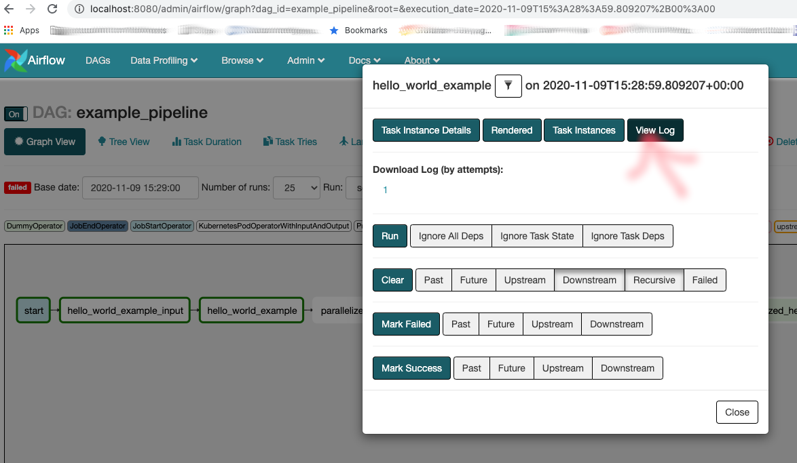

<!--
Licensed to the Apache Software Foundation (ASF) under one
or more contributor license agreements.  See the NOTICE file
distributed with this work for additional information
regarding copyright ownership.  The ASF licenses this file
to you under the Apache License, Version 2.0 (the
"License"); you may not use this file except in compliance
with the License.  You may obtain a copy of the License at

  http://www.apache.org/licenses/LICENSE-2.0

Unless required by applicable law or agreed to in writing,
software distributed under the License is distributed on an
"AS IS" BASIS, WITHOUT WARRANTIES OR CONDITIONS OF ANY
KIND, either express or implied.  See the License for the
specific language governing permissions and limitations
under the License.
-->

# Getting started / ***Hello World***

This guide will allow you to set up your first Apache Liminal environment and allow you to create
some simple ML pipelines. These will be very similar to the ones you are going to build for real
production scenarios.

## Prerequisites

Python 3 (3.6 and up)

[Docker Desktop](https://www.docker.com/products/docker-desktop)

*Note: Make sure kubernetes cluster is running in docker desktop (or custom kubernetes installation
on your machine).*

## Deploying the Example

In this tutorial, we will go through setting up Liminal for the first time on your local machine.

### First, let’s build our example project:

In the dev folder, just clone the example code from liminal:


```BASH
git clone https://github.com/apache/incubator-liminal
```
***Note:*** *You just cloned the entire Liminal Project, you actually only need examples folder.*

Create a python virtual environment to isolate your runs:

```BASH
cd incubator-liminal/examples/liminal-getting-started
python3 -m venv env
```

Activate your virtual environment:

```BASH
source env/bin/activate
```

Now we are ready to install liminal:

```BASH
pip install apache-liminal
```
Let's build the images you need for the example:
```BASH
liminal build
```
##### The build will create docker images based on the liminal.yml file in the `images` section.
Create a kubernetes local volume:
```BASH
liminal create
```
```BASH
liminal deploy --clean
```
The deploy command deploys a liminal server and deploys any liminal.yml files in your working
directory or any of its subdirectories to your liminal home directory.

*Note: liminal home directory is located in the path defined in LIMINAL_HOME env variable.
If the LIMINAL_HOME environemnet variable is not defined, home directory defaults to
~/liminal_home directory.*

Now lets runs liminal:
```BASH
liminal start
```
The start command spins up the liminal server containers which will run pipelines based on your
deployed liminal.yml files.
It runs the following three containers:
* liminal-postgress
* liminal-webserver
* liminal-scheduler

Once liminal server has completed starting up, you can navigate to admin UI in your browser:
[http://localhost:8080](http://localhost:8080)
By default liminal server starts Apache Airflow servers and admin UI will be that of Apache Airflow.


***Important:** Set off/on toggle to activate your pipeline (DAG), nothing will happen otherwise!*

You can go to graph view to see all the tasks configured in the liminal.yml file:
[http://localhost:8080/admin/airflow/graph?dag_id=example_pipeline](
http://localhost:8080/admin/airflow/graph?dag_id=example_pipeline
)

#### Now lets see what actually happened to our task:


#### Click on “hello_world_example” and you will get this popup:




#### Click on “view log” button and you can see the log of the current task run:


## Mounted volumes
All tasks use a mounted volume as defined in the pipeline YAML:
```YAML
name: GettingStartedPipeline
volumes:
  - volume: gettingstartedvol
    claim_name: gettingstartedvol-pvc
    local:
      path: .
```
In our case the mounted volume will point to the liminal hello world example. \
The hello world task will read the **hello_world.json** file from the mounted volume and will write
the **hello_world_output.json** to it.

*Note:* Each task will internally mount the volume defined above to an internal representation,
described under the task section in the yml:

```YAML
  task:
  ...
  mounts:
     - mount: taskmount
       volume: gettingstartedvol
       path: /mnt/vol1
```


## Here are the entire list of commands, if you want to start from scratch:

```
git clone https://github.com/apache/incubator-liminal
cd examples/liminal-getting-started
python3 -m venv env
source env/bin/activate
pip uninstall apache-liminal
pip install apache-liminal
Liminal build
Liminal create
liminal deploy --clean
liminal start
```

## Closing up

To make sure liminal containers are stopped use:
```
liminal stop
```

To deactivate the python virtual env use:
```
deactivate
```
