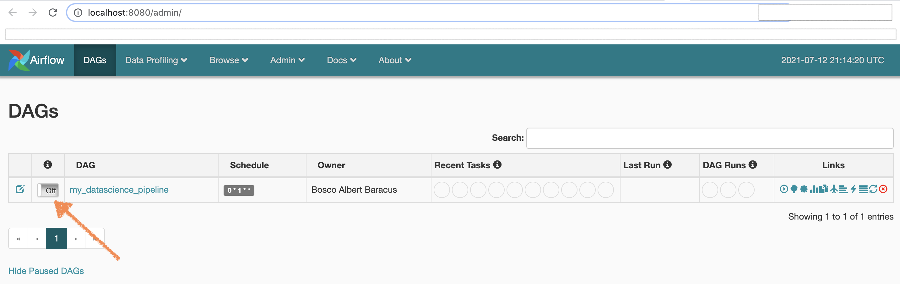
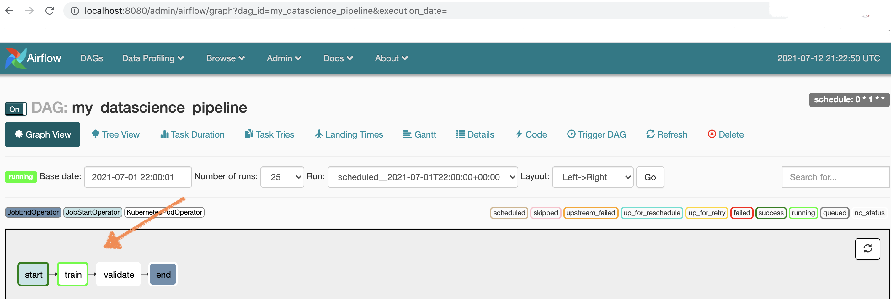
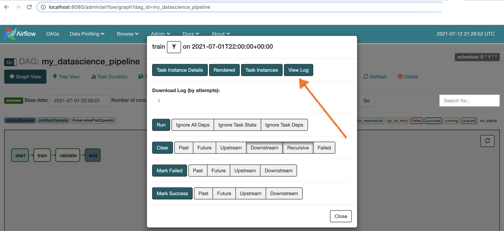
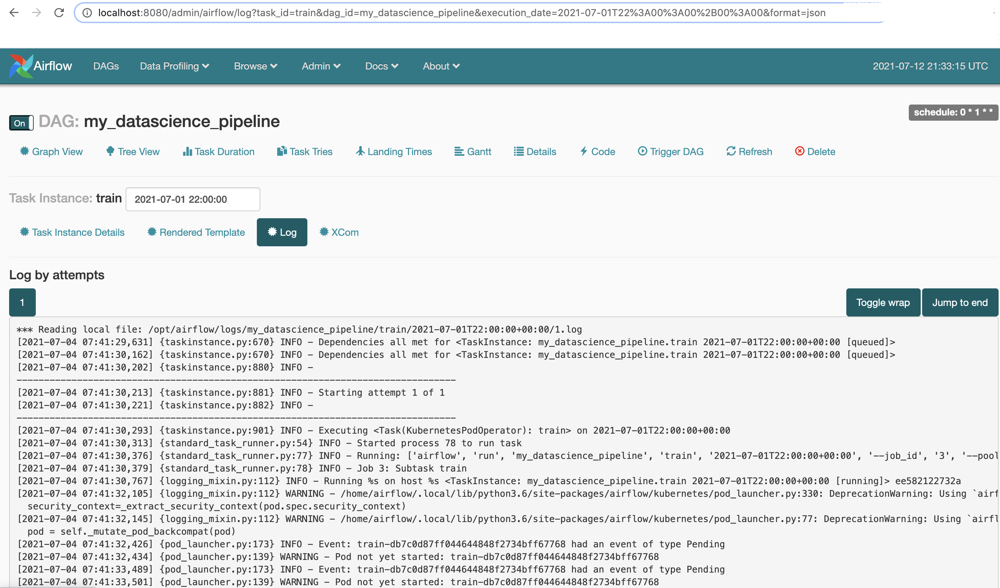

<!--
Licensed to the Apache Software Foundation (ASF) under one
or more contributor license agreements.  See the NOTICE file
distributed with this work for additional information
regarding copyright ownership.  The ASF licenses this file
to you under the Apache License, Version 2.0 (the
"License"); you may not use this file except in compliance
with the License.  You may obtain a copy of the License at

  http://www.apache.org/licenses/LICENSE-2.0

Unless required by applicable law or agreed to in writing,
software distributed under the License is distributed on an
"AS IS" BASIS, WITHOUT WARRANTIES OR CONDITIONS OF ANY
KIND, either express or implied.  See the License for the
specific language governing permissions and limitations
under the License.
-->

# Getting started / ***Iris Classification***

In this tutorial, we will guide you through setting up Apache Liminal on your local machine and run the simple machine-learning workflow example.

* [Setup your local environment](#Setup-your-local-environment)
* [Setup liminal](#setup-liminal)
    * [Liminal build](#Liminal-build)
    * [Liminal create](#Liminal-create)
    * [Liminal deploy](#Liminal-deploy)
    * [Liminal start](#Liminal-start)
* [Liminal YAML walkthrough](#Liminal-YAML-walkthrough)
* [Evaluate the Iris Classification model](#Evaluate-the-iris-classification-model)
* [Debugging Kubernetes Deployments](#Debugging-Kubernetes-Deployments)
* [Closing up](#Closing-up)


#### Prerequisites

* [Python 3 (3.6 and up)](https://www.python.org/downloads)
* [Python Virtual Environments](https://pypi.org/project/virtualenv)
* [Docker Desktop](https://www.docker.com/products/docker-desktop)

*Note: Make sure kubernetes cluster is running in docker desktop*

We will define the following steps and services to implement the Iris classification example: \
Train, Validate & Deploy - Training and validation execution is managed by Liminal Airflow extension. The training task trains a regression model using a public dataset. \
We then validate the model and deploy it to a model-store in mounted volume. \
Inference - online inference is done using a Python Flask service running on the local Kubernetes in docker desktop. The service exposes the `/predict` endpoint. It reads the model stored in the mounted drive and uses it to evaluate the request.
## Setup your local env environment

In the dev folder, clone the example code from liminal:


```BASH
git clone https://github.com/apache/incubator-liminal
```
***Note:*** *You just cloned the entire Liminal Project, you actually only need examples folder.*


Create a python virtual environment to isolate your runs:

```BASH
cd incubator-liminal/examples/aws-ml-app-demo
python3 -m venv env
```

Activate your virtual environment:

```BASH
source env/bin/activate
```

Now we are ready to install liminal:

```BASH
pip install apache-liminal
```

## Setup liminal
### Liminal build
The build will create docker images based on the liminal.yml file in the `images` section.
```BASH
liminal build
```

### Liminal create
All tasks use a mounted volume as defined in the pipeline YAML. \
In our case the mounted volume will point to the liminal Iris Classification example.
The training task trains a regression model using a public dataset. We then validate the model and deploy it to a model-store in the mounted volume.

Create a kubernetes local volume:
```BASH
liminal create
```

### Liminal deploy
The deploy command deploys a liminal server and deploys any liminal.yml files in your working directory or any of its subdirectories to your liminal home directory.
```BASH
liminal deploy --clean  
```

*Note: liminal home directory is located in the path defined in LIMINAL_HOME env variable.
If the LIMINAL_HOME environemnet variable is not defined, home directory defaults to
~/liminal_home directory.*

### Liminal start
The start command spins up 3 containers that load the Apache Airflow stack. Liminal's Airflow extension is responsible to execute the workflows defined in the liminal.yml file as standard Airflow DAGs.
```BASH
liminal start
```

It runs the following three containers: 
* liminal-postgress
* liminal-webserver
* liminal-scheduler

Once liminal server has completed starting up, you can navigate to admin UI in your browser:
[http://localhost:8080](http://localhost:8080)




***Important:** Set off/on toggle to activate your pipeline (DAG), nothing will happen otherwise!*

You can go to graph view to see all the tasks configured in the liminal.yml file: 
[http://localhost:8080/admin/airflow/graph?dag_id=my_datascience_pipeline](
http://localhost:8080/admin/airflow/graph?dag_id=my_datascience_pipeline
)

#### Now lets see what actually happened to our task:



#### Click on “train” and you will get this popup:



#### Click on “view log” button and you can see the log of the current task run:


## Liminal YAML walkthrough
* [Mounted volumes](#Mounted-volumes)
* [Pipeline flow](#Pipeline-flow)

### Mounted volumes
Describe the mounted volume in your liminal YAML:
```YAML
name: MyDataScienceApp
owner: Bosco Albert Baracus
volumes:
  - volume: gettingstartedvol
    claim_name: gettingstartedvol-pvc
    local:
      path: .
```

### Pipeline flow
Setting up the pipeline flow with the following tasks:
```YAML
pipelines:
  - pipeline: my_datascience_pipeline
    ...
    schedule: 0 * 1 * *
    tasks:
      - task: train
        type: python
        description: train model
        image: myorg/mydatascienceapp
        cmd: python -u training.py train
        ...
      - task: validate
        type: python
        description: validate model and deploy
        image: myorg/mydatascienceapp
        cmd: python -u training.py validate
        ...
```

##### Each task will internally mount the volume defined above to an internal representation, described under the task section in the yml:

```YAML
pipelines:
    ...
    tasks:
      - task: train
        ...
        env:
          MOUNT_PATH: /mnt/gettingstartedvol
        mounts:
          - mount: mymount
            volume: gettingstartedvol
            path: /mnt/gettingstartedvol
```
###### We specify the `MOUNT_PATH` in which we store the trained model.

## Evaluate the iris classification model

Once the iris classification model is complete, you can launch a pod of the pre-built image which contains a flask server:

```YAML
cat <<EOF | kubectl apply -f -
---
apiVersion: v1
kind: Pod
metadata:
  name: aws-ml-app-demo
spec:
  volumes:
    - name: task-pv-storage
      persistentVolumeClaim:
        claimName: gettingstartedvol-pvc
  containers:
    - name: task-pv-container
      imagePullPolicy: Never
      image: myorg/mydatascienceapp
      lifecycle:
        postStart:
          exec:
            command: ["/bin/bash", "-c", "apt update && apt install curl -y"]
      ports:
        - containerPort: 80
          name: "http-server"
      volumeMounts:
        - mountPath: "/mnt/gettingstartedvol"
          name: task-pv-storage
EOF
```

Check that the service is running:
```BASH
kubectl get pods --namespace=default
```

Check that the service is up:
```BASH
kubectl exec -it --namespace=default aws-ml-app-demo -- /bin/bash -c "curl localhost/healthcheck"
```

Check the prediction:
```BASH
kubectl exec -it --namespace=default aws-ml-app-demo -- /bin/bash -c "curl -X POST -d '{\"petal_width\": \"2.1\"}' localhost/predict"
```

## Debugging Kubernetes Deployments
kubectl get pods will help you check your pod status:
```BASH
kubectl get pods --namespace=default
```
kubectl logs will help you check your pods log:
```BASH
kubectl logs --namespace=default aws-ml-app-demo
```
kubectl exec to get a shell to a running container:
```BASH
kubectl exec --namespace=default aws-ml-app-demo -- bash
```
Then you can check the mounted volume `df -h` and to verify the result of the model.


## Here are the entire list of commands, if you want to start from scratch:

```
git clone https://github.com/apache/incubator-liminal
cd examples/aws-ml-app-demo
python3 -m venv env
source env/bin/activate
pip uninstall apache-liminal
pip install apache-liminal
Liminal build
Liminal create
liminal deploy --clean
liminal start
```

## Closing up

To make sure liminal containers are stopped use:
```
liminal stop
```

To deactivate the python virtual env use:
```
deactivate
```

To terminate the kubernetes pod:
```
kubectl delete pod --namespace=default aws-ml-app-demo
```
