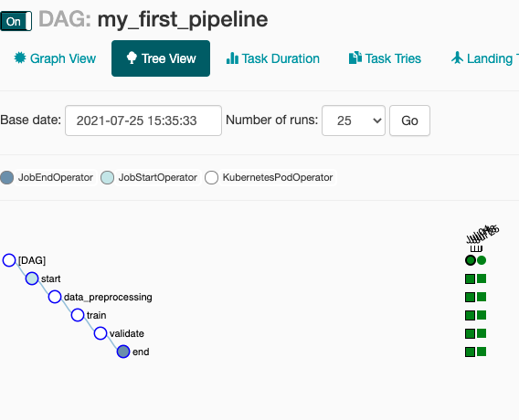

<!--
Licensed to the Apache Software Foundation (ASF) under one
or more contributor license agreements.  See the NOTICE file
distributed with this work for additional information
regarding copyright ownership.  The ASF licenses this file
to you under the Apache License, Version 2.0 (the
"License"); you may not use this file except in compliance
with the License.  You may obtain a copy of the License at

  http://www.apache.org/licenses/LICENSE-2.0

Unless required by applicable law or agreed to in writing,
software distributed under the License is distributed on an
"AS IS" BASIS, WITHOUT WARRANTIES OR CONDITIONS OF ANY
KIND, either express or implied.  See the License for the
specific language governing permissions and limitations
under the License.
-->

# Getting started / ***Spark application***

* [Setup your local environment](#Setup-your-local-environment)
* [Spark on K8S](#Spark-On-K8S)
    * [Setup liminal](#setup-liminal)
    * [Liminal YAML walkthrough](#Liminal-YAML-walkthrough)
    * [Evaluate the Iris Classification model](#Evaluate-the-iris-classification-model)
    * [Debugging Kubernetes Deployments](#Debugging-Kubernetes-Deployments)

* [Closing up](#Closing-up)

In this tutorial, we will guide you through setting up Apache Liminal on your local machine and run
a simple machine-learning workflow, based on the classic Iris dataset classification example
including a feature engineering with Spark engine. \
More details in
this [link](https://scikit-learn.org/stable/auto_examples/datasets/plot_iris_dataset.html).

#### Prerequisites

* [Python 3 (3.6 and up)](https://www.python.org/downloads)
* [Python Virtual Environments](https://pypi.org/project/virtualenv)
* [Docker Desktop](https://www.docker.com/products/docker-desktop)
* [Kubernetes CLI (kubectl)](https://kubernetes.io/docs/tasks/tools/install-kubectl-macos)

*Note: Make sure kubernetes cluster is running in docker desktop*

## Setup your local env environment

In the dev folder, clone the example code from liminal:

```BASH
git clone https://github.com/apache/incubator-liminal
```

***Note:*** *You just cloned the entire Liminal Project, you actually only need examples folder.*

Create a python virtual environment to isolate your runs:

```BASH
cd incubator-liminal/examples/spark-app-demo/
python3 -m venv env
```

Activate your virtual environment:

```BASH
source env/bin/activate
```

Now we are ready to install liminal:

```BASH
pip install apache-liminal
```

## Spark On K8S

We will define the following steps and services to implement the Iris classification example
including a simple feature engineering with Apache Spark: \
Clean data, Train, Validate & Deploy - Cleaning the input data set and prepare it for training and
validation execution is managed by Liminal Airflow extension. The training task trains a regression
model using a public dataset. \
We then validate the model and deploy it to a model-store in mounted volume. \
Inference - online inference is done using a Python Flask service running on the local Kubernetes in
docker desktop. The service exposes the `/predict` endpoint. It reads the model stored in the
mounted drive and uses it to evaluate the request.

### Setup liminal

```BASH
cd incubator-liminal/examples/spark-app-demo/k8s
```

#### Liminal build
The build will create docker images based on the liminal.yml file in the `images` section and will create a kubernetes local volume.

Be informed that all tasks use a mounted volume as defined in the pipeline YAML. \
In our case the mounted volume will point to the liminal Iris Classification example.
The training task trains a regression model using a public dataset. We then validate the model and deploy it to a model-store in the mounted volume.
```BASH
liminal build
```

#### Liminal deploy

The deploy command deploys a liminal server and deploys any liminal.yml files in your working
directory or any of its subdirectories to your liminal home directory.

```BASH
liminal deploy --clean
```

*Note: liminal home directory is located in the path defined in LIMINAL_HOME env variable. If the
LIMINAL_HOME environemnet variable is not defined, home directory defaults to
~/liminal_home directory.*

#### Liminal start

The start command spins up 3 containers that load the Apache Airflow stack. Liminal's Airflow
extension is responsible to execute the workflows defined in the liminal.yml file as standard
Airflow DAGs.

```BASH
liminal start
```

You can go to graph view to see all the tasks configured in the liminal.yml file:
[http://localhost:8080/admin/airflow/graph?dag_id=my_first_spark_pipeline](
http://localhost:8080/admin/airflow/graph?dag_id=my_first_spark_pipeline
)

You should see the following dag:



### Liminal YAML walkthrough

* [Local archetype](#Local-archetype)
* [Pipeline flow](#Pipeline-flow)

#### Local archetype

A superliminal for an easy local development

```YAML
name: InfraSpark
owner: Bosco Albert Baracus
type: super
executors:
  - executor: k8s
    type: kubernetes
variables:
  output_root_dir: /mnt/gettingstartedvol
  input_root_dir: ''
images:
  - image: my_spark_image
    type: spark
    source: .
    no_cache: True
task_defaults:
  spark:
    executor: k8s
    executors: 2
    application_source: '{{application}}'
    mounts:
      - mount: mymount
        volume: gettingstartedvol
        path: /mnt/gettingstartedvol
```

###### We specify the `MOUNT_PATH` in which we store the trained model.

You can read more about `superliminal` `variables` and `defaults`
in [advanced.liminal.yml](../liminal/advanced.liminal.yml.md)

#### Pipeline flow

Declaration of the pipeline tasks flow in your liminal YAML:

```YAML
name: MyFirstLiminalSparkApp
super: InfraSpark
owner: Bosco Albert Baracus
variables:
  output_path: '{{output_root_dir}}/my_first_liminal_spark_app_outputs/'
  application: data_cleanup.py
task_defaults:
  python:
    mounts:
      - mount: mymount
        volume: gettingstartedvol
        path: /mnt/gettingstartedvol
pipelines:
  - pipeline: my_first_spark_pipeline
    start_date: 1970-01-01
    timeout_minutes: 45
    schedule: 0 * 1 * *
    tasks:
      - task: data_preprocessing
        type: spark
        description: prepare the data for training
        application_arguments:
          - '{{input_root_dir}}data/iris.csv'
          - '{{output_path}}'
      - task: train
        type: python
        description: train model
        image: myorg/mydatascienceapp
        cmd: python -u training.py train '{{output_path}}'
        env:
          MOUNT_PATH: /mnt/gettingstartedvol
        ...
```

### Evaluate the iris classification model

Once the Iris Classification model trainging is completed and model is deployed (to the mounted
volume), you can launch a pod of the pre-built image which contains a flask server, by applying the
following Kubernetes manifest configuration:

```BASH
kubectl apply -f manifests/spark-app-demo.yaml
```

Alternatively, create a Kubernetes pod from stdin:

```YAML
cat <<EOF | kubectl apply -f -
---
apiVersion: v1
kind: Pod
metadata:
  name: spark-app-demo
spec:
  volumes:
    - name: task-pv-storage
      persistentVolumeClaim:
        claimName: gettingstartedvol-pvc
  containers:
    - name: task-pv-container
      imagePullPolicy: Never
      image: myorg/mydatascienceapp
      lifecycle:
        postStart:
          exec:
            command: [ "/bin/bash", "-c", "apt update && apt install curl -y" ]
      ports:
        - containerPort: 80
          name: "http-server"
      volumeMounts:
        - mountPath: "/mnt/gettingstartedvol"
          name: task-pv-storage
EOF
```

Check that the service is running:

```BASH
kubectl get pods --namespace=default
```

Check that the service is up:

```BASH
kubectl exec -it --namespace=default spark-app-demo -- /bin/bash -c "curl localhost/healthcheck"
```

Check the prediction:

```BASH
kubectl exec -it --namespace=default spark-app-demo -- /bin/bash -c "curl -X POST -d '{\"petal_width\": [1.1,1.1,1.1,1.1]}' localhost/predict"
```

## Debugging Kubernetes Deployments

kubectl get pods will help you check your pod status:

```BASH
kubectl get pods --namespace=default
```

kubectl logs will help you check your pods log:

```BASH
kubectl logs --namespace=default spark-app-demo
```

kubectl exec to get a shell to a running container:

```BASH
kubectl exec --namespace=default spark-app-demo -- bash
```

Then you can check the mounted volume `df -h` and to verify the result of the model.

You can go to graph view to see all the tasks configured in the liminal.yml file:
[http://localhost:8080/admin/airflow/graph?dag_id=my_first_pipeline](
http://localhost:8080/admin/airflow/graph?dag_id=my_first_pipeline

## Here are the entire list of commands, if you want to start from scratch:

```
git clone https://github.com/apache/incubator-liminal
cd examples/spark-app-demo/k8s
# cd examples/spark-app-demo/emr
python3 -m venv env
source env/bin/activate
rm -rf ~/liminal_home
pip uninstall apache-liminal
pip install apache-liminal
Liminal build
Liminal create
liminal deploy --clean
liminal start
```

## Closing up

To make sure liminal containers are stopped use:

```
liminal stop
```

To deactivate the python virtual env use:

```
deactivate
```

To terminate the kubernetes pod:

```
kubectl delete pod --namespace=default spark-app-demo
```
