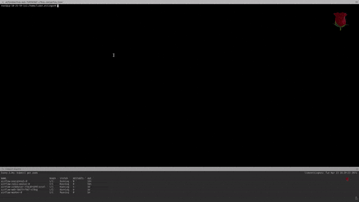

<!--
Licensed to the Apache Software Foundation (ASF) under one
or more contributor license agreements.  See the NOTICE file
distributed with this work for additional information
regarding copyright ownership.  The ASF licenses this file
to you under the Apache License, Version 2.0 (the
"License"); you may not use this file except in compliance
with the License.  You may obtain a copy of the License at

  http://www.apache.org/licenses/LICENSE-2.0

Unless required by applicable law or agreed to in writing,
software distributed under the License is distributed on an
"AS IS" BASIS, WITHOUT WARRANTIES OR CONDITIONS OF ANY
KIND, either express or implied.  See the License for the
specific language governing permissions and limitations
under the License.
-->

# Install Liminal in Airflow
* [Workflow](#workflow)
* [Prerequisites](#prerequisites)
* [One time setup](#One-time-environment-setup)
* [Deploying your Yaml files](#Deploying-your-Yaml-files)
* [References and other resources](#references-and-other-resources)

## Workflow
To deploy and run liminal on airflow, we need to complete two tasks:
1. Ensure that the Liminal python package is installed inside each one of Airflow's pods (schedulers, Workers and Web Server). \
This is a standard airflow management task, which can be achieved in multiple ways depending on your setup (we will cover a few later in this guide).
2. Ensure that the user's Liminal code (i.e. Yamls) are present in each of the pods' DAGs folder (typically located in /opt/airflow/dags). \
Here, our recommended approach is to use a folder on a shared filesystem (EFS) to host the airflow DAGs (and Liminal Yamls). \
This folder will be mounted into Airflow pods' DAGs folder - thus enabling each of the pods to pick the files up and run the Liminal DAGs.


Below is a description of how to achieve this task using a commonly used Helm chart for Airflow on Kubernetes.

## Prerequisites
### Airflow on Kubernetes
This guide assumes you have successfully installed Airflow on Kubernetes.

If you haven't done so yet, we found the following Helm chart useful for achieving this goal:
[airflow-helm-chart-7.16.0]

You'll need to add the chart to your Helm installation and follow the instructions from the README.md
```sh
helm repo add airflow-stable https://airflow-helm.github.io/charts
helm repo update
```

### A provisioned EFS file system
EFS is an AWS solution which offers an NFS as a service. \
You can read up about EFS [here](https://aws.amazon.com/efs/features/) and set it up via AWS console or CLI.

## One time environment setup
### Adding the Apache Liminal package to Apache Airflow pods

There are multiple ways to install liminal into the Airflow pods, depending on how you deployed Airflow on Kubernetes. \
In principle, it requires the package to be pip-installed into the Airflow docker - either during build time or in run time.

1. If you are rolling out your own Airflow Docker images based on the [official docker image](https://github.com/apache/airflow),
you can add apache-liminal installation during the build:
```docker build --build-arg ADDITIONAL_PYTHON_DEPS="apache-liminal"```

2. If you already have a running Airflow on Kubernetes, you can run a command which iterates over Airflow pods and executes a ```pip install apache-liminal```
on each of the pods.

3. If you used the [airflow-helm-chart-7.16.0], you just need to specifiy apache-liminal inside the ```requirements.txt``` file as per the instructions [here][airflow-helm-chart-7.16.0]


### Preparing a "deployment box" and an EFS folder to host the Liminal Yaml files
The "deployment box" is the machine which has access to the Yamls you want to deploy. \
This machine will also mount the same EFS folder as Airflow, and use ```liminal deploy``` to push the Yamls into that folder.

1. Provision an EC2 instance which has access to the EFS

3. Mount the EFS onto the EC2 instance

```sudo mount -t nfs4 -o nfsvers=4.1,rsize=1048576,wsize=1048576,hard,timeo=600,retrans=2,noresvport <EFS_ID>:/ /mnt/efs```

3. Create a folder on an EFS drive. \
This will be our target for deployment
```mkdir -p /mnt/efs/opt/airflow/liminal_home```

4. ```export LIMINAL_HOME=/mnt/efs/opt/airflow/liminal_home```

### Mounting the EFS folder into Airflow pods

Now that we have an EFS drive, and we've created the shared folder on it, it's time to mount it onto the Airflow pods` Dags folder.
The [guide][airflowInstallation] includes details on how to expose EFS as a Persistent Volume for kubernetes.

Make sure to point the pods' PV to the right EFS folder, like so:

```
volumeMounts:
    - name: efs-data
      mountPath: /opt/airflow/dags
```

where efs-data is a PVC pointing to `<EFS_ID>:/opt/airflow/liminal_home`


## Deploying your Yaml files

Finally, the one time setup is done, and by this point, you should have:
1. A deployment box which can deploy Liminal to an EFS folder
2. Airflow pods which will pick up the Yamls from that folder automatically.

Deploying the actual Yaml files is the simple part.

Each time you want to deploy the Liminal Yamls from the deployment box:
```
liminal deploy --path <<<path to liminal user code>>>
```

## References and other resources

### Setting up Airflow on Kubernetes with EFS
[Setting up Airflow on Kubernetes with AWS EFS][airflowInstallation]

### Example script
In order to make it easier to undernstad all the steps, we include a script which performs the Liminal-specific steps in the deployment.
This script should be run from an EC2 machine which has access to the EFS you've provisioned. \
The below steps runs the example project of [liminal-getting-started][liminal-getting-started].
* Mount the EFS and setting environment parameters:
  * [`liminal_aws_deploy.sh`][liminal-aws-deploy] -o installation
* Build dockers from your business logic:
  * [`liminal_aws_deploy.sh`][liminal-aws-deploy] -o build
* Deploy the Yaml onto the EFS folder:
  * [`liminal_aws_deploy.sh`][liminal-aws-deploy] -o deployment



##### Seting up AWS ECR with kubernetes
[How to configure and use AWS ECR with kubernetes][AWS-ECR-with-kubernetes]

1. `liminal_aws_deploy.sh -o build` will build dockers from the given liminal project path. \
The [liminal.yml][liminal-yml] defindes a docker image :
```
    tasks:
      - task: python_hello_world_example
        type: python
        description: static input task
        image: python_hello_world_example_image
```
The Yaml defines task that will pull the docker image from your predefined registry. \
Therefore, you need to use a docker registry in your kubernetes cluster. \
One way to achieve it is to use [Amazon ECR][amazon-ecr].

[AWS-ECR-with-kubernetes]: <https://medium.com/@damitj07/how-to-configure-and-use-aws-ecr-with-kubernetes-rancher2-0-6144c626d42c>
[amazon-ecr]: <https://aws.amazon.com/ecr/>
[liminal-yml]: <https://github.com/apache/incubator-liminal/blob/master/examples/liminal-getting-started/liminal.yml>
[liminal-getting-started]: <https://github.com/apache/incubator-liminal/tree/master/examples/liminal-getting-started>
[airflow-helm-chart-7.16.0]: <https://github.com/airflow-helm/charts/tree/airflow-7.16.0>
[homebrew-kubectl]: <https://formulae.brew.sh/formula/kubernetes-cli>
[cluster-access-kubeconfig]: <https://kubernetes.io/docs/concepts/configuration/organize-cluster-access-kubeconfig/#context>
[liminal-aws-deploy]: <https://github.com/apache/incubator-liminal/tree/master/docs/source/liminal_aws_deploy.sh>
[airflowChart]: <https://github.com/airflow-helm/charts/tree/main/charts/airflow>
[airflowInstallation]: <https://medium.com/terragoneng/setting-up-airflow-on-kubernetes-with-aws-efs-c659f3a16292>
[airflowImage]: <https://hub.docker.com/layers/apache/airflow/1.10.12-python3.6/images/sha256-9ea9e5ca66bd17632241889ab248fe3852c9f3c830ed299a8ecaa8a13ac2082f?context=explore>
