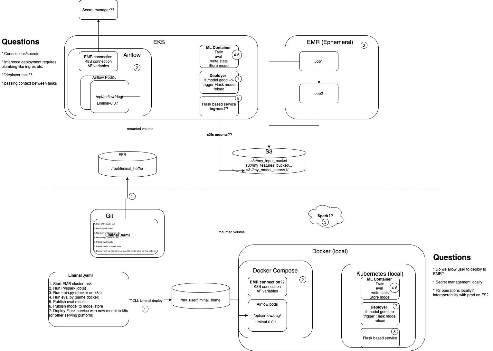
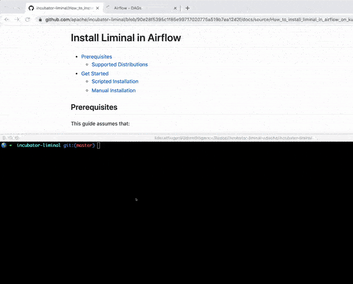

<!--
Licensed to the Apache Software Foundation (ASF) under one
or more contributor license agreements.  See the NOTICE file
distributed with this work for additional information
regarding copyright ownership.  The ASF licenses this file
to you under the Apache License, Version 2.0 (the
"License"); you may not use this file except in compliance
with the License.  You may obtain a copy of the License at

  http://www.apache.org/licenses/LICENSE-2.0

Unless required bgit y applicable law or agreed to in writing,
software distributed under the License is distributed on an
"AS IS" BASIS, WITHOUT WARRANTIES OR CONDITIONS OF ANY
KIND, either express or implied.  See the License for the
specific language governing permissions and limitations
under the License.
-->

# Install Liminal in Airflow
* [Workflow](#workflow)
* [Prerequisites](#prerequisites)
   * [Supported Distributions](#supported-distributions)
* [Get Started](#Get-Started)
   * [Scripted Installation](#scripted-installation)
   * [Manual Installation](#manual-installation)
* [References and other resources](#references-and-other-resources)

## Workflow
Liminal deploys into the Airflow components and the Yamls home folder is mounted by EFS.
The process of liminal is emphasized on the following diagram:



## Prerequisites
Before you begin, ensure you have met the following requirements:

* You have a Kubernetes cluster running with [Helm][homebrew-helm] (and Tiller if using Helm v2.x) installed
* You have the kubectl command line [(kubectl CLI)][homebrew-kubectl] installed
* You have the current [context][cluster-access-kubeconfig] in kubernetes' kubeconfig file
* You have [Airflow on Kubernetes with AWS EFS][airflowInstallation]
* You have already created [Liminal Yaml file][liminal-yaml-file] following the liminal [Getting Started Documentation][liminalGetStarted-doc]
* Make sure that the [example repository][liminal-getting-started-project] is your workspace

### Supported Distributions

|Distribution | Versions |
|-|-|
|[Airflow][airflowImage] | apache/airflow:1.10.12-python3.6 |
|[Airflow Helm Chart][airflowChart] | 7.14.3 |

#### You may need to add the Repo

```sh
helm repo add airflow-stable https://airflow-helm.github.io/charts
helm repo update
```

## Get Started

### Scripted Installation

[Use `install_liminal_in_airflow_on_kubernetes.sh`][liminal-installation-script] to install liminal in Airflow.
* Move to the [example repository project][liminal-getting-started-project]
* Copy the [script][liminal-installation-script] to the [example repository project][liminal-getting-started-project] and run it



### Manual Installation

Here are a couple of steps of how to install liminal in Airflow on Kubernetes:
* [Find Airflow components](#Find-Airflow-pod-names)
* [Install liminal in the components](#Install-liminal-in-Airflow-pods)
* [Setting up liminal](#Setting-up-liminal)

#### Find Airflow pod names:

```sh
echo -n "Please enter a namespace: "
read namespace
components=("web" "scheduler" "worker")
namespace=${namespace}
podNames=()
for component in ${components[@]}
do
        podNames+="$(kubectl get pod -n ${namespace} -l "app=airflow,component=${component}" --no-headers -o custom-columns=":metadata.name")\n"

done

echo -e "The following Airflow pods are:\n${podNames}"
```
#### Install liminal in Airflow pods:

```sh
IFS=$'\n'|''; set -f; podNames=( ${podNames} )
webPodName=${podNames[${#podNames[@]} - 1]}

for podName in `echo -e ${podNames[@]}`
do
        echo "Installing liminal in pod: ${podName}"
        kubectl exec -it -n ${namespace} ${podName} -- bash -c 'pip install --user apache-liminal'
done
```

#### Setting up liminal:
There are a couple of ways to deploy Yamls in Airflow.
1. Mount your Amazon EFS file system on a Linux instance:
    ```
    sudo mount -t nfs4 -o nfsvers=4.1,rsize=1048576,wsize=1048576,hard,timeo=600,retrans=2,noresvport <EFS_ID>:/ /opt/airflow/dags
    ```
2. Use gitsync function in order to sync Yamls in the Amazon EFS file system. In this case, we chose to use a kubernetes job:
    ```
    apiVersion: batch/v1
    kind: Job
    metadata:
      namespace: production
      name: airflower-production-git
    spec:
      activeDeadlineSeconds: 60
      backoffLimit: 1
      template:
        spec:
          containers:
          - name: git
            image: alpine/git
            command: ["/bin/sh","-c"]
            args: ["cd /dags; git fetch && git reset --hard origin/master"]
            volumeMounts:
            - mountPath: /dags
              name: dags
          volumes:
          - name: dags
            persistentVolumeClaim:
              claimName: airflow-production
          restartPolicy: Never
    ```
3. Deploy the Yamls by using kubectl in order to copy the Yamls to the mounted file system. In this case, we chose to use kubectl to copy the Yamls to the mounted EFS:
    ```sh
    echo "Deploying liminal"
    webPodName=$(echo -e $webPodName)
    kubectl exec -it $webPodName  -- bash -c "find '/home/airflow/' -path  '*liminal/runners/airflow/dag/liminal_dags.py'| xargs -I {} cp -p {} /opt/airflow/dags/"
    kubectl exec -it $webPodName  -- bash -c "mkdir -p /opt/airflow/dags/pipelines/"
    kubectl cp liminal.yml ${namespace}/$webPodName:/opt/airflow/dags/pipelines/
    ```

## References and other resources

* You can refer to the following blog with a step by step configuration on [Setting up Airflow on Kubernetes with AWS EFS][airflowInstallation]

[homebrew-kubectl]: <https://formulae.brew.sh/formula/kubernetes-cli>
[homebrew-helm]: <https://formulae.brew.sh/formula/helm>
[cluster-access-kubeconfig]: <https://kubernetes.io/docs/concepts/configuration/organize-cluster-access-kubeconfig/#context>
[liminal-yaml-file]: <https://github.com/apache/incubator-liminal#example-yaml-config-file>
[liminalGetStarted-doc]: <https://github.com/apache/incubator-liminal/blob/master/docs/source/getting_started_with_liminal.md>
[liminal-installation-script]: <https://github.com/apache/incubator-liminal/tree/master/docs/source/install_liminal_in_airflow_on_kubernetes.sh>
[liminal-getting-started-project]: <https://github.com/apache/incubator-liminal/tree/master/examples/liminal-getting-started>
[findAirflowComponents]: <https://github.com/joemccann/dillinger.git>
[airflowChart]: <https://github.com/airflow-helm/charts/tree/main/charts/airflow>
[airflowInstallation]: <https://medium.com/terragoneng/setting-up-airflow-on-kubernetes-with-aws-efs-c659f3a16292>
[airflowImage]: <https://hub.docker.com/layers/apache/airflow/1.10.12-python3.6/images/sha256-9ea9e5ca66bd17632241889ab248fe3852c9f3c830ed299a8ecaa8a13ac2082f?context=explore>